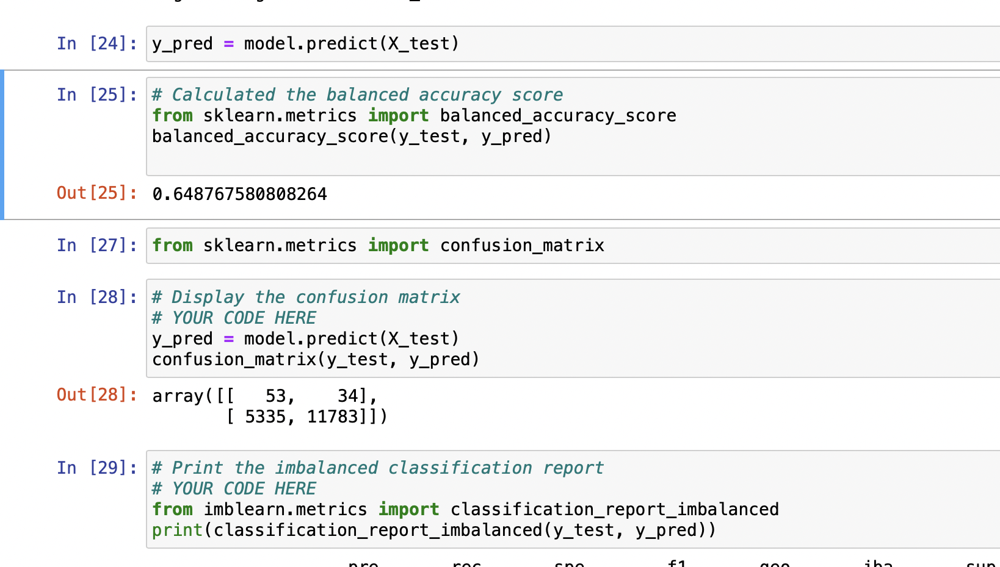
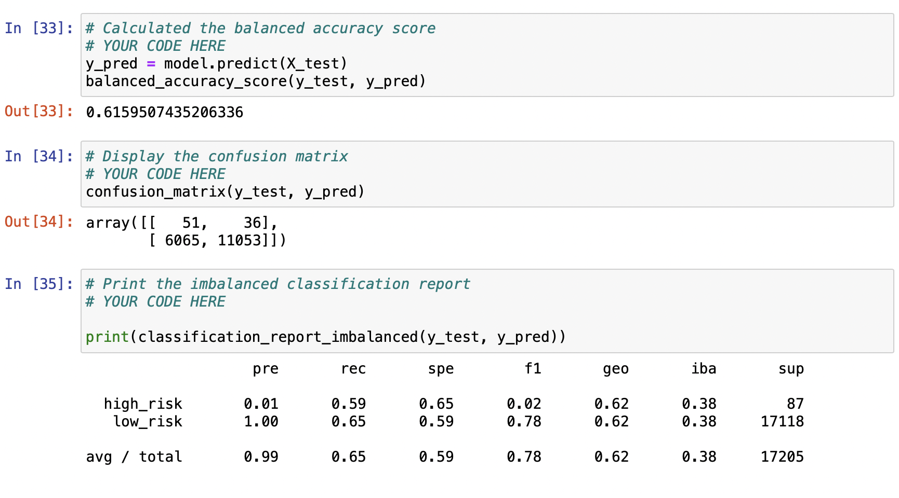
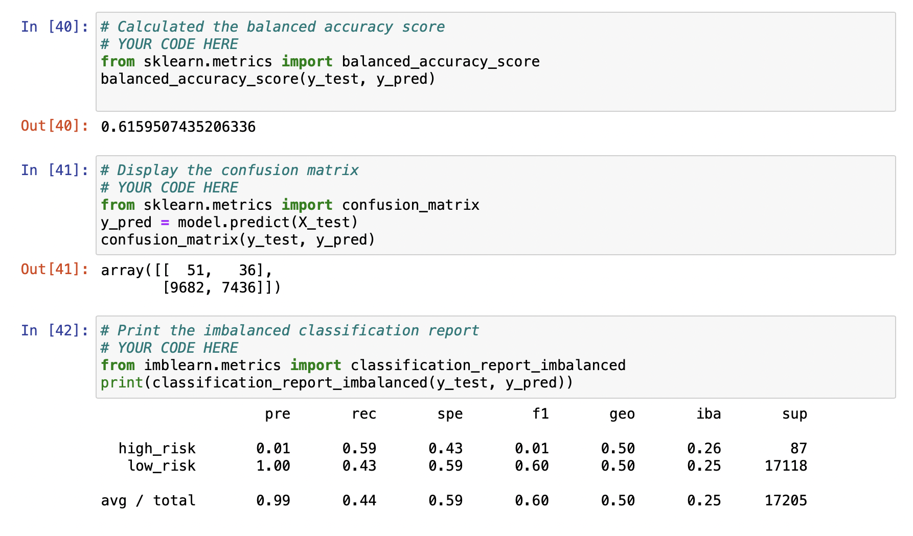
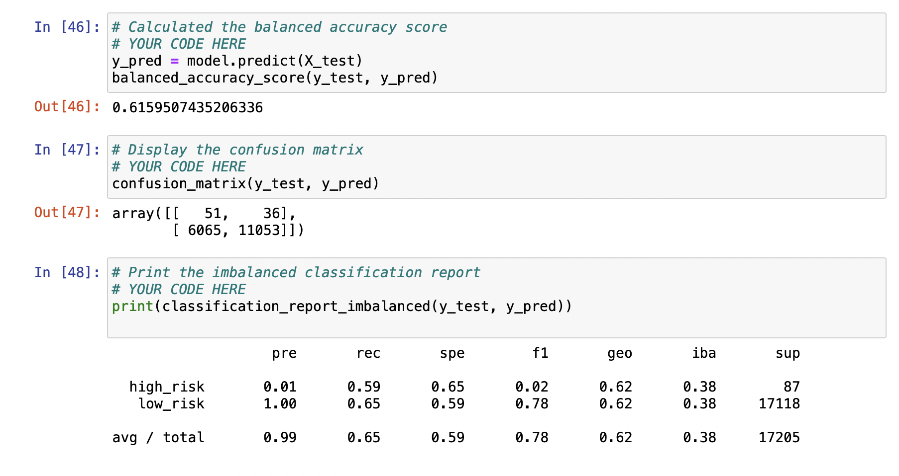
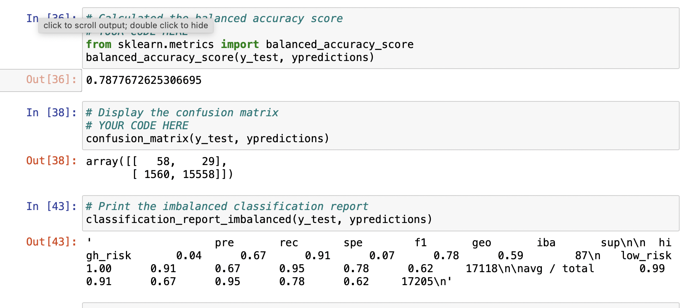
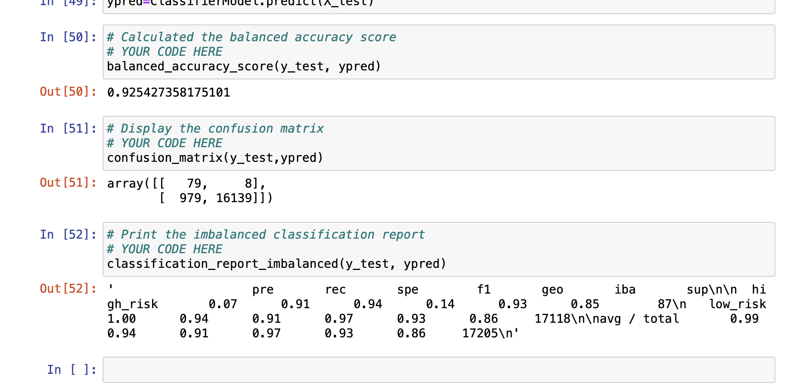

# Credit_Risk_Analysis  
## Purpose of Analysis 

The purpose of this challenge was to evaluate the performance of two different models using multiple techniques.  

## Results 
 
Native Random Oversampling 

 

SMOTE Oversampling 

 

Undersampling  
 
   
 
Combination
  
    
 
 Balanced Random Forest Classifier  
 
    

Easy Ensemble AdaBoost Classifier 

    
 
 
 ## Summary 
 
 The Easy Ensemble Classifier algorithm had the highest level of accuracy at a .92%. I would use the Easy Ensemble Classifier because of the factors of  high accuracy and high precision. 
